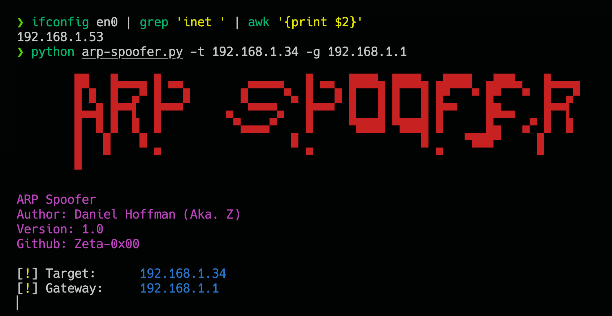
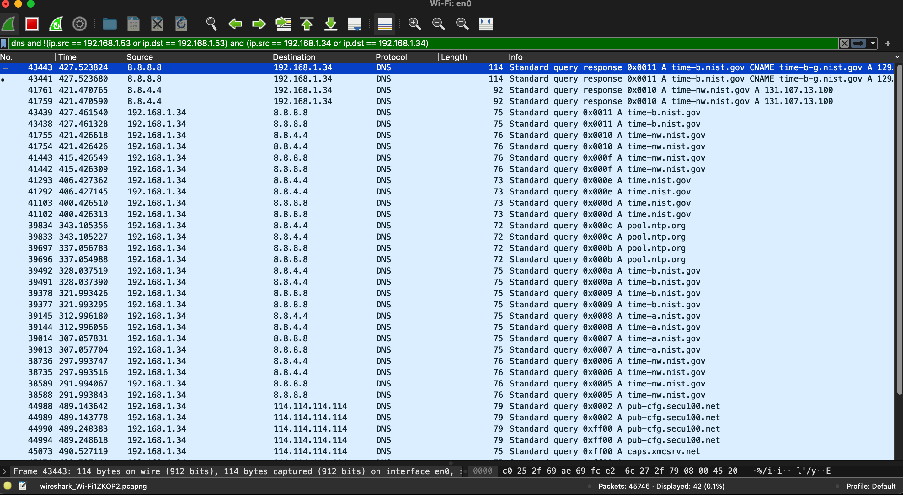

# ARP-Spoofer
 Simple ARP Spoofer using Scapy

 # Requirements
- Python 3.6+
- Scapy
- Termcolor

# Installation
```bash
pip install -r requirements.txt
```

# ARP Spoofing
ARP Spoofing is a type of attack in which a malicious actor sends falsified ARP (Address Resolution Protocol) messages over a local area network. This results in the linking of an attacker's MAC address with the IP address of a legitimate computer or server on the network. Once the attacker's MAC address is linked to an authentic IP address, the attacker will begin receiving any data that is intended for that IP address. ARP spoofing can enable malicious parties to intercept, modify or

# Usage
```haskell
python arp_spoofer.py -t <target_ip> -g <gateway_ip>
```
## WireShark Filter
```haskell
dns and !(ip.src == <attacker ip> or ip.dst == <attacker ip>) and (ip.src == <victim ip> or ip.dst == <victim ip>)
```

# Example




